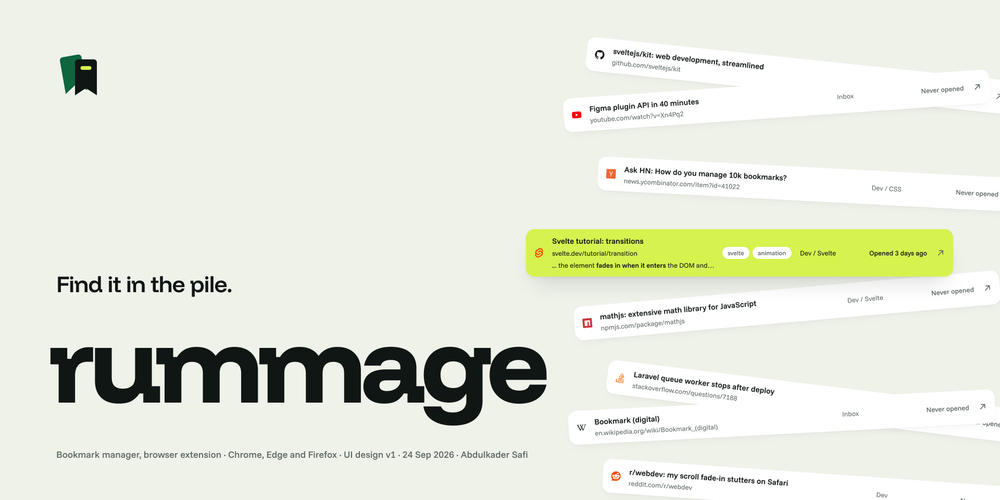

<p></p>

# Rummage



Rummage is a Chrome extension for people with thousands of bookmarks. It replaces Chrome's bookmark manager at `chrome://bookmarks` and works on Chrome's own bookmarks, so there is nothing to import, no account, and Chrome sync keeps working. Uninstall it and your bookmarks are exactly where they were.

It is built for the other end of saving: finding a link again, and clearing out a pile that is years old.

## What it does

- Search what a page said. Search covers titles, addresses, folders, tags, your notes and, if you switch it on, the saved text of every page. Each result says where it matched and quotes the sentence.
- Clean up. Lists dead links (with a Wayback Machine lookup), duplicates that only differ by tracking tags or a trailing slash, links that now redirect, and links you never opened. Nothing is deleted until you confirm, and removed links sit in a bin for 30 days.
- The state of the pile. One bar on the home page splits your library into kept, inbox, never opened, saved twice and dead, and shows how close you are to Chrome's 100,000-bookmark sync limit.
- Save with context. Alt+S opens a save popup that keeps the page text, guesses the folder from where you filed the same site before, and takes tags, a note and a one-week reminder.
- Command bar. Alt+K on any page, or ⌘K / Ctrl K inside Rummage, searches bookmarks and open tabs together. You can also type `rm`, a space and a query in the address bar.
- Tags and notes on any bookmark, stored next to Chrome's data rather than inside it.
- Rules that file new bookmarks by site or keyword.
- Backups every day or week to your Downloads folder, and export to HTML, JSON, CSV or Markdown.
- Import from other browsers' bookmark files (Firefox, Safari, Edge, Arc), Raindrop and Pocket exports, or a Rummage JSON file.

## Install

Rummage is not on the Chrome Web Store yet. To run it from this folder:

1. Open `chrome://extensions` and turn on Developer mode.
2. Click "Load unpacked" and pick this folder.
3. Click the Rummage icon in the toolbar, or go to `chrome://bookmarks`.

After changing any file, click the reload arrow on the extension card, then reload the Rummage tab.

## Keyboard

| Keys | What it does |
|---|---|
| Alt+S | Save the page you are on |
| Alt+K | Command bar over any page |
| `rm`, then a space | Search from the address bar |
| ⌘K or Ctrl K | Command bar inside Rummage |
| `/` | Jump to the search box |
| ↑ ↓ or `j` `k` | Move through the list |
| Enter | Open the current link |
| `x` | Select the current link |
| Delete | Move to the bin |

Change the Alt shortcuts at `chrome://extensions/shortcuts`.

## Privacy

Everything Rummage keeps stays in your Chrome profile: tags, notes, page text, link results and the bin live in the extension's local database. Nothing is sent to a server Rummage runs, because there isn't one.

Page search and link checks are off until you turn them on, and Chrome asks for access to all sites when you do. With them on, Rummage visits each saved address in the background, a few at a time and never more than one request every two seconds per site. Requests go out without your cookies. Dead links trigger one lookup at archive.org to find a Wayback Machine copy.

Rummage reads your browsing history for one thing: counting how often you opened each bookmark.

## Limits

These are real, and worth knowing before you trust a clean-up list.

- "Never opened" is only as good as Chrome's history. Chrome keeps about 90 days of history, so a link you opened a year ago looks unopened. Rummage counts every visit from the day it is installed.
- Pages behind a login are read logged out. Rummage fetches without your cookies, so it saves the login page, not your content. Link checks mark login walls as worth a look, not dead.
- Dead is a judgement. A 404 or 410 is dead at once. Timeouts and server errors only count after failing on three separate days. Some sites block automated checks, so review before you bin.
- Page text is extracted simply. Text is pulled from the page's HTML without running its scripts, so pages that build their content in the browser may save little text. Pages you save with Alt+S keep what you saw on screen instead.
- Search holds page text in memory. This is fast into the tens of thousands of pages. Very large libraries with page search on will use a lot of memory while you search.
- Very large scheduled backups may fail. Scheduled backups are written as one file from the background. The export buttons in Settings work at any size.
- Chrome only for now. It should also run in other Chromium browsers such as Edge and Brave, but only Chrome has been tried. Firefox is not supported.

## Files

```
manifest.json    Permissions, shortcuts and the chrome://bookmarks override
background.js    Page reading, link checks, rules, backups, the address bar and shortcuts
lib.js           Shared code: URL matching, the local database, search, exports
page.html/.js    The manager
popup.html/.js   The Alt+S save popup and the Add link sheet
cmd.js           The command bar, used by the manager and command.html
reader.html/.js  The saved copy of a page
ui.js            Small DOM helpers
page.css         All styles
icons/           Logo, extension icons and the icon set
```

There is no build step and no dependencies. The design comes from the Rummage Figma file: Funnel Display and Funnel Sans, one lime accent, and white cards on a paper background.

## Developer

Built by [Abdulkader Safi](https://abdulkadersafi.com/?utm_source=rummage&utm_medium=readme&utm_campaign=github).

## Support

If this extension is useful, you can support the work at
[ko-fi.com/abdulkadersafi](https://ko-fi.com/abdulkadersafi).

## License

MIT. See [LICENSE](LICENSE).
